## Gallery

### Home
|   |
|:--:|
|  
Home
 |

---

### Settings
|   |
|:--:|
| 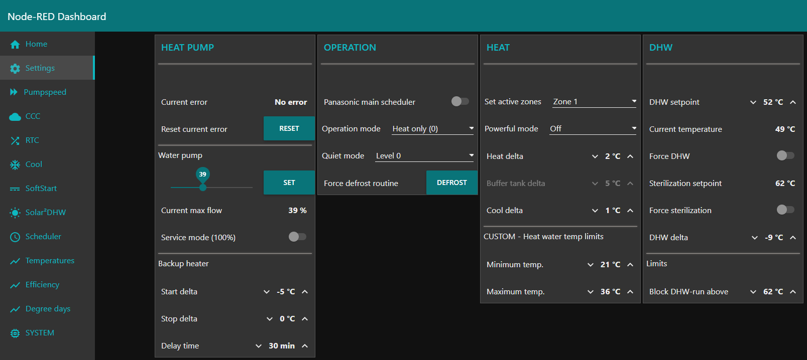 
Settings
 |

---

### Pumpspeed
|   |
|:--:|
| 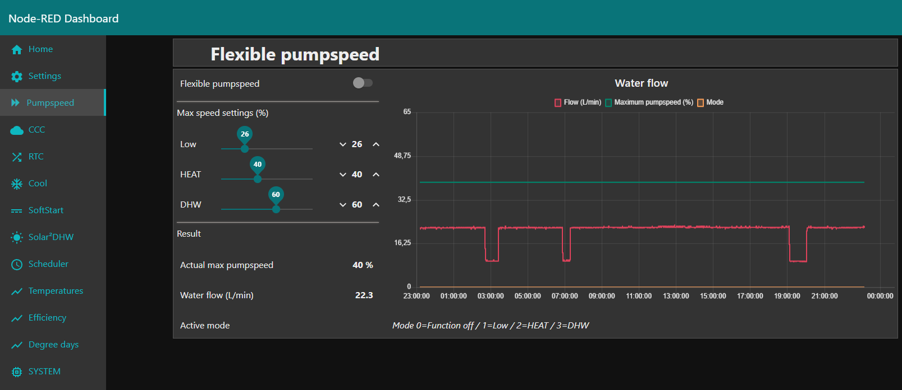 
Pumpspeed (Custom function)
 |

---

### CCC
|   |
|:--:|
| 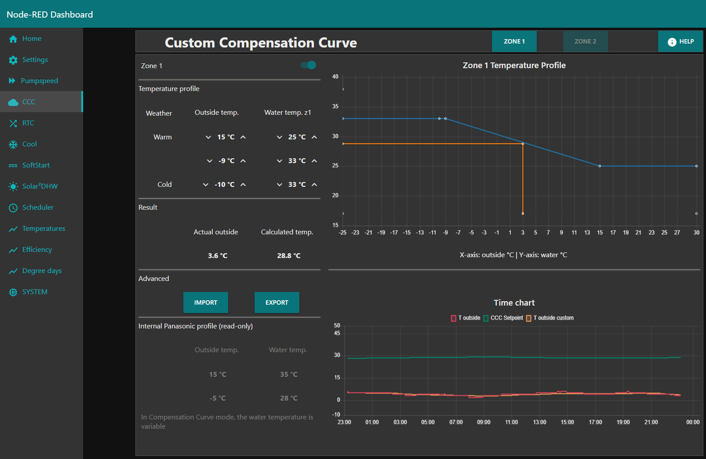 
CCC (Custom function)
 |

---

### RTC
|   |
|:--:|
|  
RTC (Custom function)
 |

---

### Cool
|   |
|:--:|
| 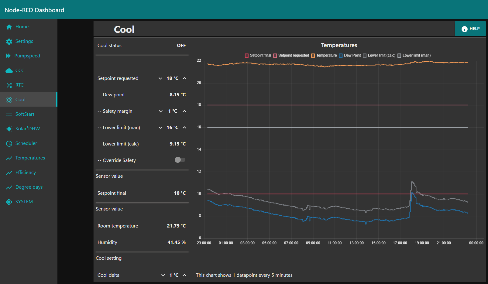 
Cool (Custom function)
 |

---

### SoftStart
|   |
|:--:|
| 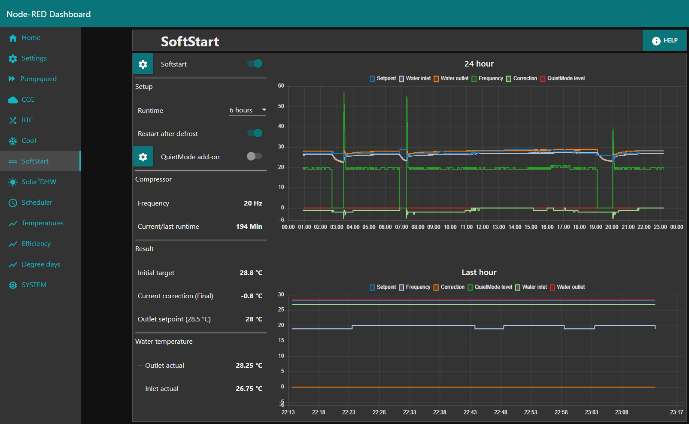 
SoftStart (Custom function)
 |

---

### Solar²DHW
|   |
|:--:|
| 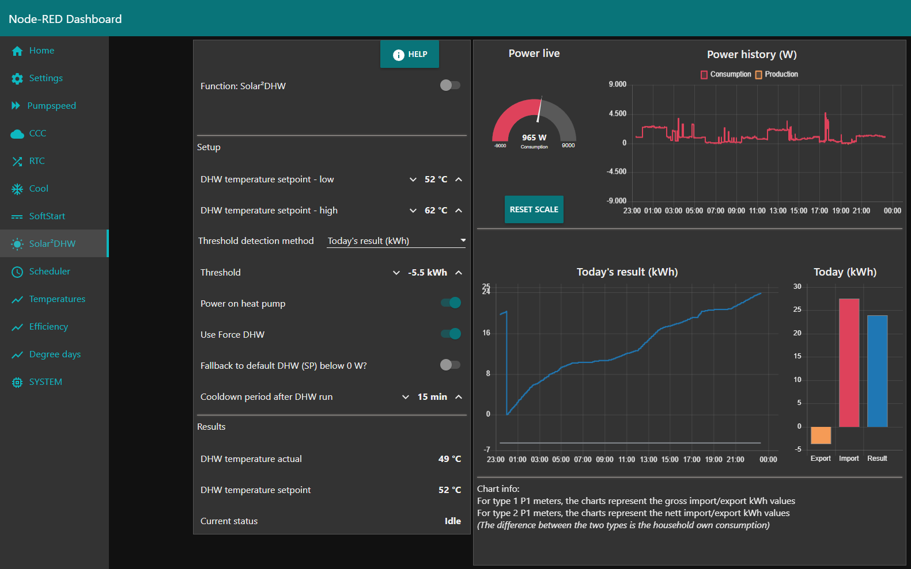 
Solar²DHW (Custom function)
 |

---

### Scheduler
|   |
|:--:|
| 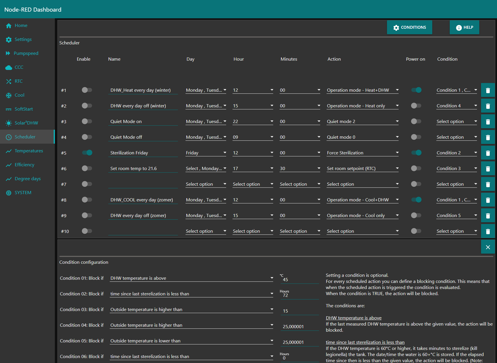 
Scheduler This is a home-built scheduler which is a lot more flexible than the panasonic version.
 |

---

### Temperatures
|   |
|:--:|
| 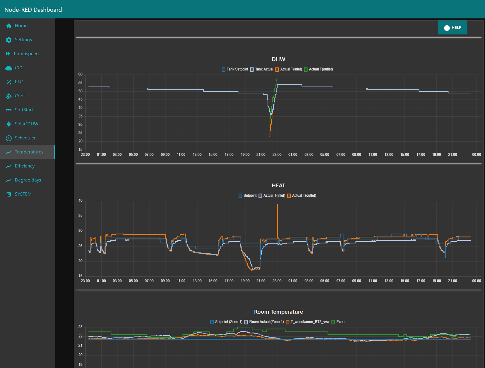 
Temperatures (Chart)
 |

---

### Efficiency
|   |
|:--:|
| 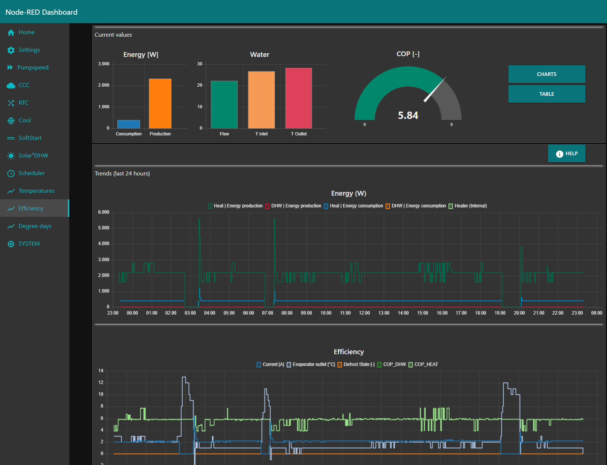 
Efficiency (Chart)
 |

---

### Degree days
|   |
|:--:|
|  
Degree days (Chart)
 |

---

### SYSTEM
|   |
|:--:|
| 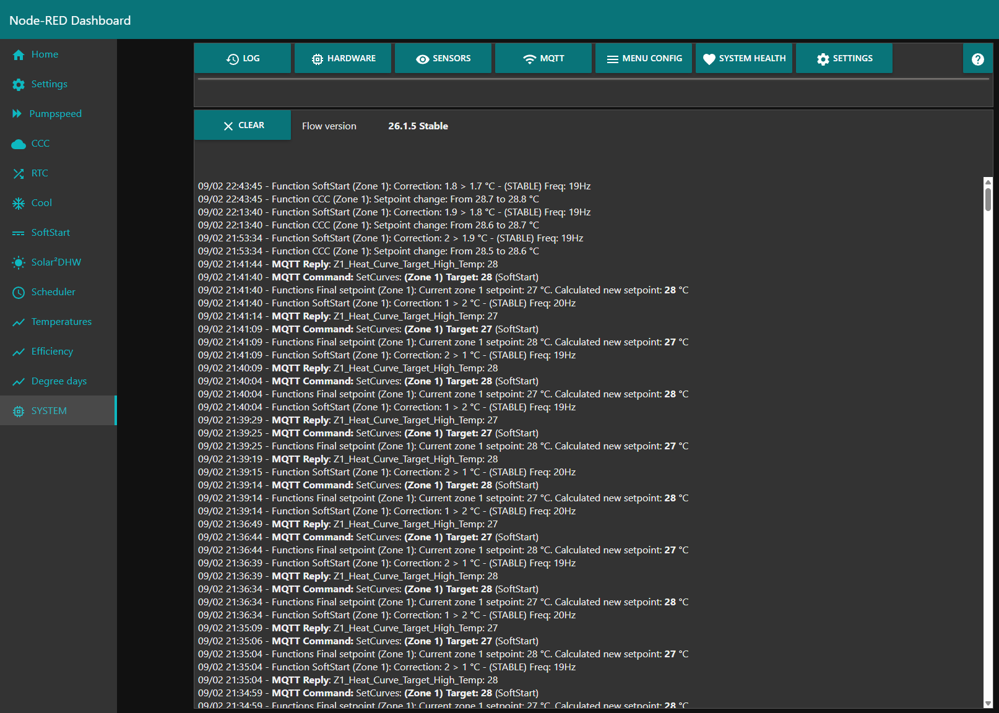 
System — Log
 |
| 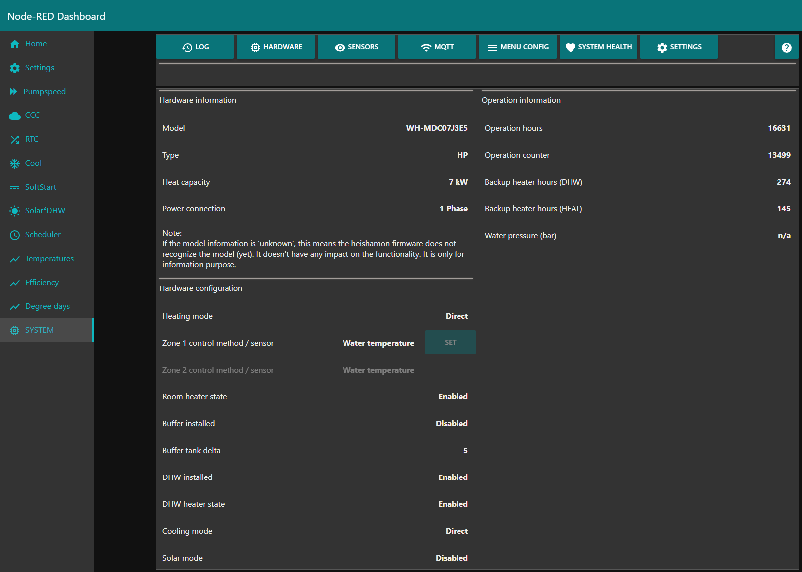 
System — Hardware
 |
| 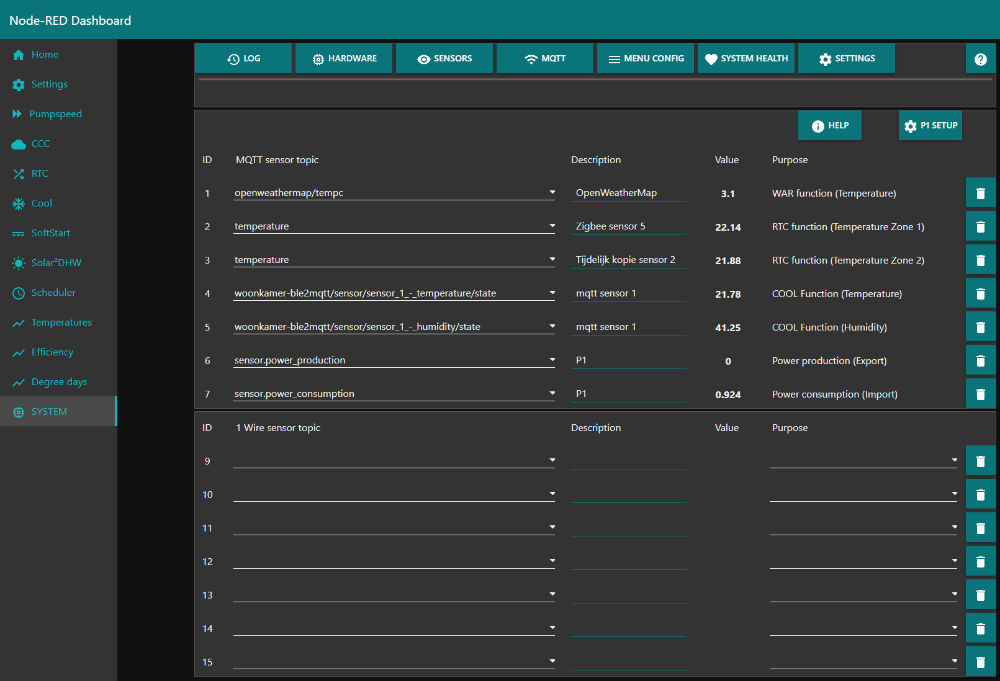 
System — Sensors Configure your custom sensors
 |
| 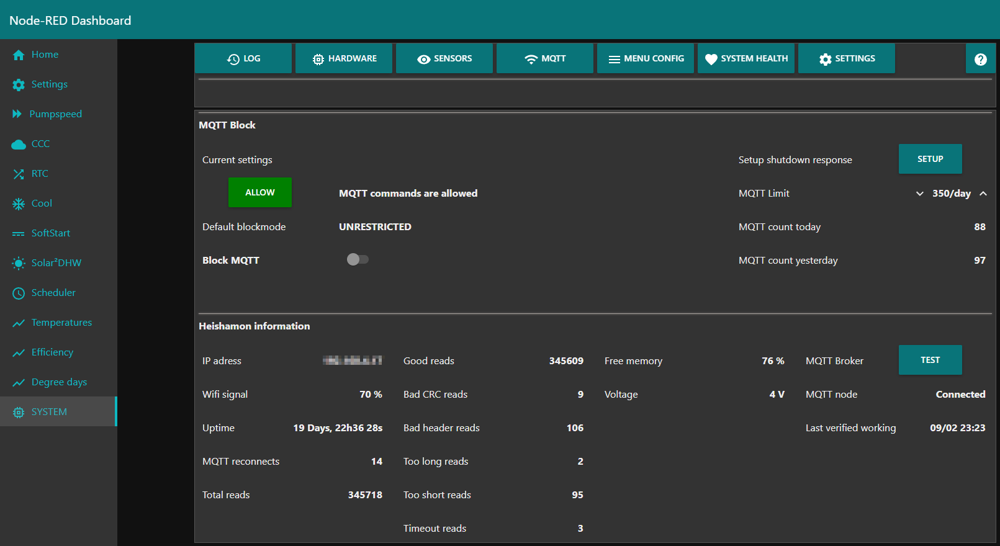 
System — MQTT
 |
| 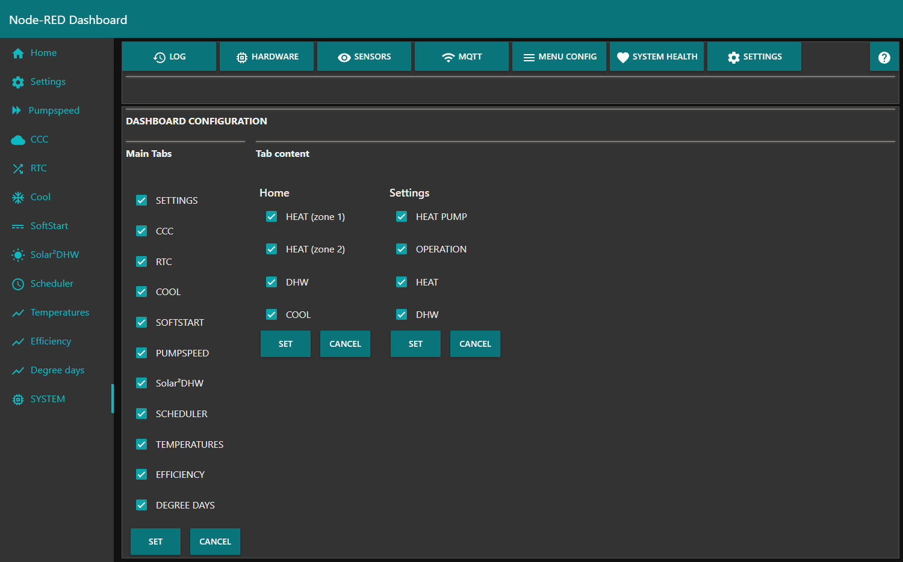 
System — Menu config  Customize the menu.
 |

