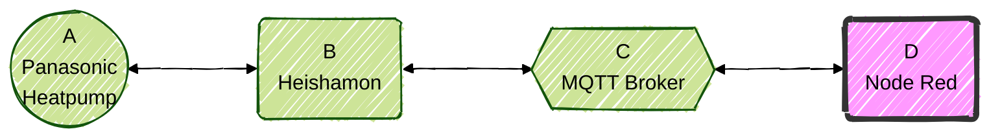
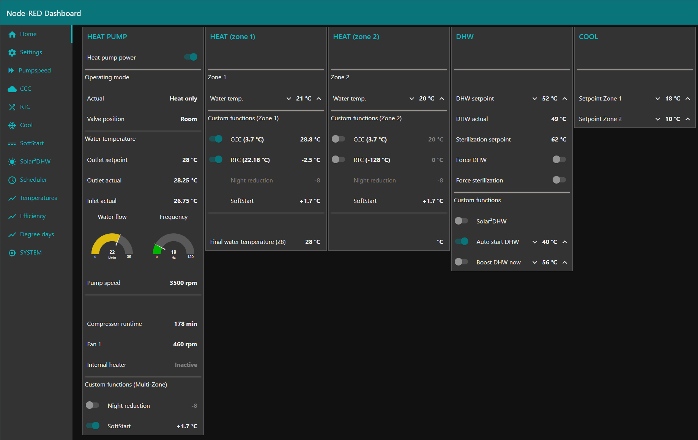
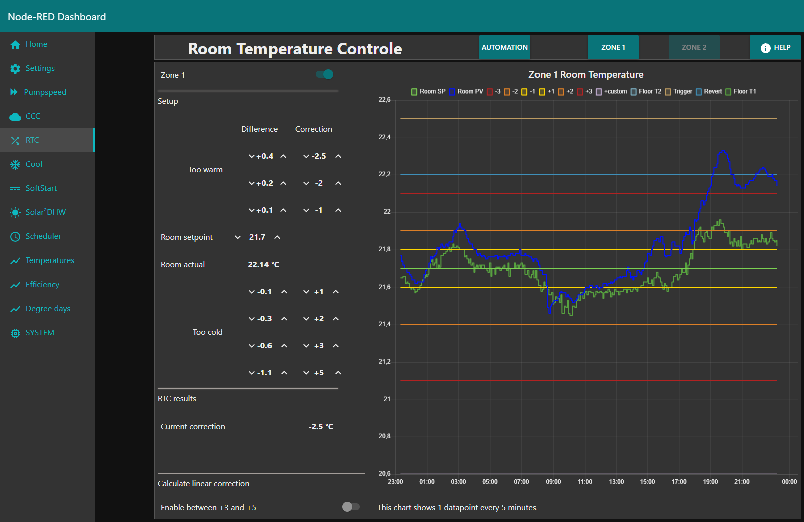

  

  

********

**Current version:** v26.2.1 Stable 
**Release date:** 2026-02-19

********

## Table of Content
- [Introduction](#introduction)
- [Gallery](documentation/gallery.md)
- [Requirements](documentation/requirements.md)
- [Installation](documentation/nodered_installation.md)
	- [Node Red](documentation/nodered_installation.md#node-red-installation)
		- [Persistent storage](documentation/nodered_installation.md#persistent-storage)
 		- [Required Node Red libraries/pallets](documentation/nodered_installation.md#required-node-red-librariespallets)
  		- [Timezone setup](documentation/nodered_installation.md#timezone-setup)
    - [Flow](documentation/flow_installation.md)
    	- [Import](documentation/flow_installation.md#1-download)
     	- [Adjust settings](documentation/flow_installation.md#3-adjust-settings)
      	- [Deploy](documentation/flow_installation.md#4-deploy-the-flow)
- [Update instructions](documentation/update_instructions.md)
- [Flow configuration](documentation/flow_configuration.md)
  - [Quick start](documentation/flow_configuration_quickstart.md)
  - [Setup Guidelines](documentation/flow_configuration_guidelines.md)
  - [Functions](documentation/flow_configuration_functions.md)
  - [External sensors](documentation/flow_configuration_external_sensors.md)
  - [Tips](documentation/flow_configuration_tips.md)
- [Changes](documentation/changes.md)
- [FAQ](documentation/faq.md)
- [Acknowledgments](documentation/acknowledgements.md)
- [Donations](documentation/donations.md)  

********

## Abstract
`HeishaMoNR` is a **Node Red flow** which gives you a user friendly dashboard for local control of your Panasonic heatpump. 

[Top](#top)

********

## Introduction
You can connect your Panasonic heatpump to the default CZ-TAW1 module. Then you are locked in the Panasonic ecosystem depending on using the wallmounted controller or Aquarea Smart Cloud.

Alternatively you can connect and control your Panasonic heatpump locally with Heishamon. The heishamon board is created by Egyras. AWESOME job! Get one here: https://www.tindie.com/stores/thehognl/  

*  A > B: The Panasonic heatpump communicates with the heishamon board
*  B > C: Heishamon communicates with your MQTT broker
*  C > D: Node Red communicates with the MQTT brokker

I have chosen to use **Node Red** (=NR) as FrontEnd and automation platform. 
In this repository you will find out all about this Node Red flow.

[Top](#top)

********

## What can `HeishaMoNR` do for you (the simple benefits)
So, what can it do.
* Offers **local control**. No dependancy on Panasonic Claud at all.
* It provides a nice **dashboard**.
* Shows detailed **graphs and charts** with real‑time or historical data.
* Allows advanced **custom functions** such as CCC, RTC, SoftStart, and Solar‑driven DHW optimizations.
* Works with **any sensor** for the custom functions. 
* **Automations** using schedules with conditions.

### A quick dashboard impression
Here are just a few images to show the dashboard. For more images look in [the gallery.](documentation/gallery.md)

*Home dashboard* 

 

*RoomTemperatureCorrection function* 

  

[Top](#top)

********
